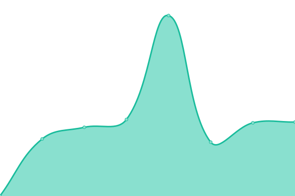

# [📈 Live Status](https://cogneon.github.io/uptime): <!--live status--> **🟩 All systems operational**

This repository contains the open-source uptime monitor and status page for [Cogneon Academy](https://cogneon.de), powered by [Upptime](https://github.com/upptime/upptime).

With [Upptime](https://upptime.js.org), you can get your own unlimited and free uptime monitor and status page, powered entirely by a GitHub repository. We use [Issues](https://github.com/cogneon/uptime/issues) as incident reports, [Actions](https://github.com/cogneon/uptime/actions) as uptime monitors, and [Pages](https://cogneon.github.io/uptime) for the status page.

<!--start: status pages-->
<!-- This summary is generated by Upptime (https://github.com/upptime/upptime) -->
<!-- Do not edit this manually, your changes will be overwritten -->
<!-- prettier-ignore -->
| URL | Status | History | Response Time | Uptime |
| --- | ------ | ------- | ------------- | ------ |
|  [cogneon.de](https://cogneon.de) | 🟩 Up | [cogneon-de.yml](https://github.com/cogneon/uptime/commits/HEAD/history/cogneon-de.yml) | 

 2504ms
     
 | 

<a href="https://cogneon.github.io/uptime/history/cogneon-de">99.93%</a>
    

|  [COPEDIA](https://wiki.cogneon.de) | 🟩 Up | [copedia.yml](https://github.com/cogneon/uptime/commits/HEAD/history/copedia.yml) | 

 1257ms
     
 | 

<a href="https://cogneon.github.io/uptime/history/copedia">99.94%</a>
    

|  [COSHARE](https://cloud.cogneon.de) | 🟩 Up | [coshare.yml](https://github.com/cogneon/uptime/commits/HEAD/history/coshare.yml) | 

 1977ms
     
 | 

<a href="https://cogneon.github.io/uptime/history/coshare">100.00%</a>
    

|  [CONNECT](https://community.cogneon.de) | 🟩 Up | [connect.yml](https://github.com/cogneon/uptime/commits/HEAD/history/connect.yml) | 

 789ms
     
 | 

<a href="https://cogneon.github.io/uptime/history/connect">100.00%</a>
    

|  [COPAD](https://pad.cogneon.io) | 🟩 Up | [copad.yml](https://github.com/cogneon/uptime/commits/HEAD/history/copad.yml) | 

 624ms
     
 | 

<a href="https://cogneon.github.io/uptime/history/copad">100.00%</a>
    

|  [COPOD](https://podcasts.cogneon.io) | 🟩 Up | [copod.yml](https://github.com/cogneon/uptime/commits/HEAD/history/copod.yml) | 

 796ms
     
 | 

<a href="https://cogneon.github.io/uptime/history/copod">100.00%</a>
    

|  [COFEED](https://feeds.cogneon.io) | 🟩 Up | [cofeed.yml](https://github.com/cogneon/uptime/commits/HEAD/history/cofeed.yml) | 

 1320ms
     
 | 

<a href="https://cogneon.github.io/uptime/history/cofeed">100.00%</a>
    

|  [Cogneon Analytics](https://analytics.cogneon.de) | 🟩 Up | [cogneon-analytics.yml](https://github.com/cogneon/uptime/commits/HEAD/history/cogneon-analytics.yml) | 

 1975ms
     
 | 

<a href="https://cogneon.github.io/uptime/history/cogneon-analytics">99.77%</a>
    

|  [lernos.org](https://lernos.org) | 🟩 Up | [lernos-org.yml](https://github.com/cogneon/uptime/commits/HEAD/history/lernos-org.yml) | 

 316ms
     
 | 

<a href="https://cogneon.github.io/uptime/history/lernos-org">100.00%</a>
    

<!--end: status pages-->

[**Visit our status website →**](https://cogneon.github.io/uptime)

## 📄 License

- Powered by: [Upptime](https://github.com/upptime/upptime)
- Code: [MIT](./LICENSE) © [Anand Chowdhary](https://anandchowdhary.com), supported by [Pabio](https://pabio.com)
- Data in the `./history` directory: [Open Database License](https://opendatacommons.org/licenses/odbl/1-0/)
